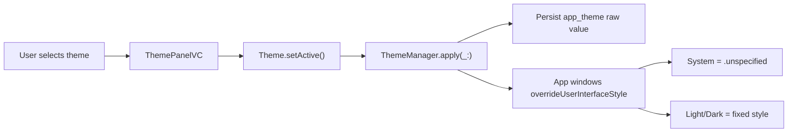
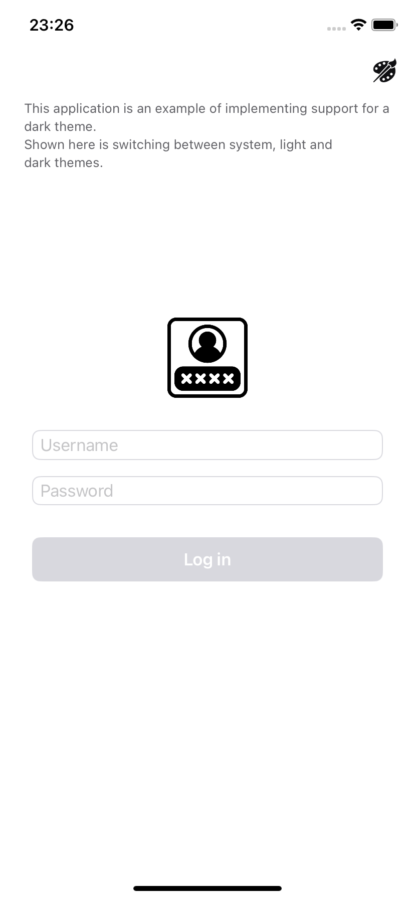
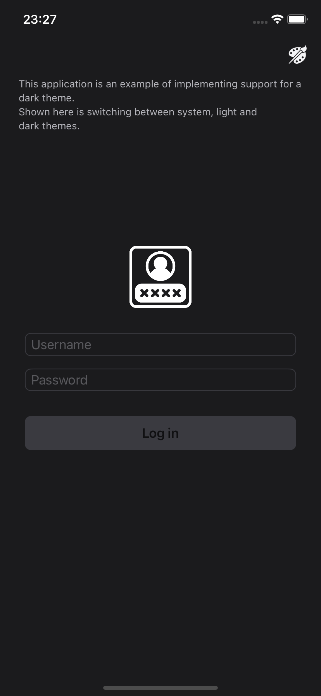
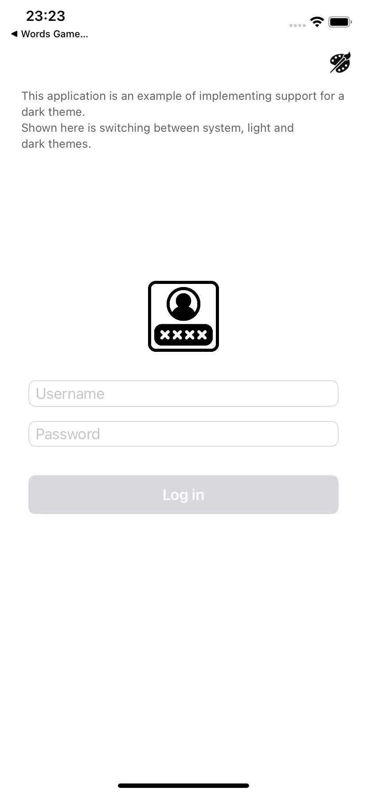

# ThemeSwitcher

ThemeSwitcher is a small UIKit sample app that demonstrates how to add `System`, `Light`, and `Dark` appearance modes to an iOS app.

The project was originally created as a companion repository for a Habr article about adding Dark Mode support in iOS. It now keeps the same lightweight UIKit shape while using iOS 15 APIs, semantic colors, Dynamic Type, accessibility labels, and a small `ThemeManager`.


## Article

The original write-up is available on Habr:

[Adding Dark Theme to iOS](https://habr.com/ru/company/bcs_company/blog/493096/)

## What This Project Shows

- Switching between `System`, `Light`, and `Dark` themes inside the app.
- Persisting the selected theme with `UserDefaults`.
- Applying the active theme to app windows through `overrideUserInterfaceStyle`.
- Using `.unspecified` for `System` so UIKit follows the current iOS appearance automatically.
- Presenting the theme picker with `UISheetPresentationController`.
- Defining app semantic colors in Asset Catalog color sets.
- Showing adaptive images, app colors, UIKit semantic colors, and controls in a dedicated demo tab.
- Building a simple UIKit app without storyboards for the main UI.
- Using `UITableViewDiffableDataSource`, Dynamic Type, and VoiceOver-friendly cell labels in the feed.

## How It Works

Theme state lives in `ThemeSwitcher/Theme`.



`Theme` defines the available modes and keeps persisted raw values stable:

- `system = 0`
- `light = 1`
- `dark = 2`

`Theme.displayName` is the user-facing label used by the picker. `ThemeManager` owns the UIKit application step: it saves the chosen value and applies the matching `UIUserInterfaceStyle` to app windows. For `System`, it applies `.unspecified`, which means the app follows iOS Light or Dark Mode without a helper window.

## Key Files

- `ThemeSwitcher/Theme/Theme.swift` - theme enum, raw values, labels, and persistence.
- `ThemeSwitcher/Theme/ThemeManager.swift` - window-level theme application.
- `ThemeSwitcher/Screens/Theme/ThemePanelVC.swift` - iOS 15 sheet-based theme selector.
- `ThemeSwitcher/Screens/MainTabs/Demo/ThemeDemoVC.swift` - palette, semantic colors, adaptive image, and component examples.
- `ThemeSwitcher/Screens/MainTabs/Feed` - diffable feed table and accessible cells.
- `ThemeSwitcher/Screens/Login/LoginVC.swift` - login validation and theme entry point.
- `ThemeSwitcher/Screens/MainTabs/Profile/ProfileVC.swift` - profile details and logout.
- `ThemeSwitcher/Resources/Assets.xcassets/Colors` - semantic color sets such as `appBackground`, `primaryText`, `secondaryText`, and `separator`.
- `ThemeSwitcherTests/ThemeSwitcherTests.swift` - persistence, raw value, label, user, and `ThemeManager` tests.

## Screenshots

Fresh simulator screenshots from the current UIKit build are kept in `images/screenshots/`:

| Light | Dark | System follows iOS |
| --- | --- | --- |
|  |  |  |

System mode was also smoke-tested against dark iOS appearance: `images/screenshots/system-dark.png`.

Original article screenshots are still kept in `images/`:

- Light flow: `images/1_l.jpg`, `images/2_l.jpg`, `images/3_l.jpg`, `images/4_l.jpg`, `images/5_l.jpg`
- Dark flow: `images/1_d.jpg`, `images/2_d.jpg`, `images/3_d.jpg`, `images/4_d.jpg`, `images/5_d.jpg`
- System colors: `images/systemColors.jpg`

## How To Reuse In Your App

1. Copy `Theme.swift`, `ThemeManager.swift`, `Theme+app.swift`, `UIWindow+theme.swift`, and `Persist.swift`.
2. Keep your theme enum raw values stable if you already persist user choices.
3. Call `window.initTheme()` before showing a new app window.
4. Present your own picker and call `theme.setActive()` when the user chooses a mode.
5. Prefer Asset Catalog color sets for app semantic colors, then use those colors throughout UIKit views.

## Requirements

- Xcode 26 or newer
- Swift 6 language mode
- iOS 15.0 or newer

## Build And Test

Open `ThemeSwitcher.xcworkspace` or `ThemeSwitcher.xcodeproj` in Xcode and run the `ThemeSwitcher` scheme.

From the command line:

```sh
xcodebuild -workspace ThemeSwitcher.xcworkspace -scheme ThemeSwitcher -destination 'generic/platform=iOS Simulator' build
xcodebuild -workspace ThemeSwitcher.xcworkspace -scheme ThemeSwitcher -destination 'platform=iOS Simulator,name=iPhone 16,OS=18.6' test
```

If your simulator list uses a different runtime, replace `OS=18.6` with an installed iOS Simulator version from `xcrun simctl list devices available`.

Manual smoke checks:

- Launch in `System` mode.
- Switch to `Light`, then `Dark`, then back to `System`.
- Log out, log in with a non-empty username, and confirm profile data updates.
- Test Dynamic Type with Large and Accessibility sizes on login, feed, theme sheet, demo, and profile.

## Notes

The project does not depend on CocoaPods, SnapKit, or any other third-party dependency. Layout is implemented with native Auto Layout constraints so the sample can be opened and built directly.
